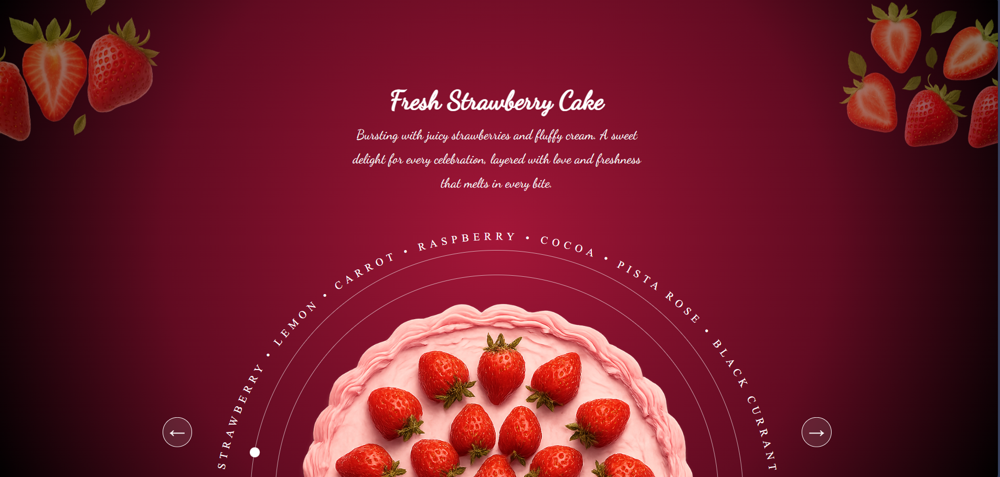

# Cake Shop Slider

A visually appealing, interactive cake showcase slider designed for a bakery or cake shop website. This slider highlights different cake flavors with images, descriptions, and navigation controls.  

---

## Features

- **Beautiful UI**: Modern design with vibrant colors and high-quality cake images.
- **Flavor Highlight**: Each slide showcases a cake flavor like Strawberry, Raspberry, Cocoa, Carrot, Pista Rose, Black Currant, Lemon, etc.
- **Navigation Controls**: Left and right arrows to easily navigate between cakes.
- **Responsive Design**: Looks great on both desktop and mobile devices.
- **Animated Slider**: Smooth transitions between cake images for a delightful user experience.

---

## Preview



---

## Installation

1. Clone the repository:

```bash
git clone https://github.com/SalmanSayed/cake-shop-slider.git
